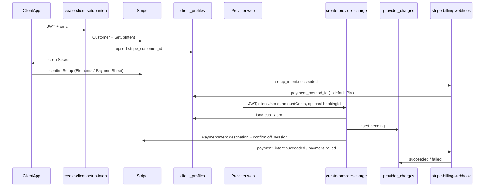

# Provider-initiated Stripe Connect billing (TEST design)

**Status:** design only — no charge/transfer implementation in this PR.  
**Mode:** Stripe **TEST** only. No live keys. No production publish.  
**Decision needed:** Drew / Software Lead approve this architecture before build.

This document maps what exists today, what must not be reused, and a TEST-mode plan for:

1. Clients save a card in the **client** app.
2. Providers initiate charges for services.
3. Funds land on the provider’s Stripe Connect connected account.

Native iOS/Android UI is **out of scope** for this repo (Mobile Lead). Shared web / Capacitor surfaces are noted below.

---

## 1. Current state

### 1.1 Repos and apps

| Surface | Repo | Role |
| --- | --- | --- |
| Provider / franchise / admin web | `drewthatcoder/always-best-care-provider` (this repo) | Landing → `/register` (franchise billing), `/provider-login`, `/admin-*`, Settings Connect payouts. Also contains leftover **client** pages (`/signup`, `/client-dashboard`, `ClientProfileSection`). |
| Client app | `drewthatcoder/always-best-care-client` (**accessible**, same org, same Supabase project `uwgfitnpesgdkiwtekcb`) | Client dashboard, profile, pending shifts. **Incomplete snapshot:** one commit (`Create .env`), 45 files. `App.tsx` still imports `SignUp` / `Register` / admin pages that are **not** in the tree. Generated `types.ts` is stale (no `client_profiles`, no `provider_profiles`). |
| Hosted backend | Supabase project `uwgfitnpesgdkiwtekcb` | Shared Auth + Postgres + Edge Functions for both apps. |
| Public site | `easycare.live` | Lovable-built provider landing (Hostinger). Not the client storefront. |

Both `package.json`s include Capacitor. In **this** repo, `isNativePlatform()` treats the native shell as the **client** experience (`Dashboard` skips provider-application gating when native). Mobile Lead owns native shells; this repo’s web pages may be wrapped later.

Lovable MCP `list_projects` in the City of Trees Tech workspace did **not** return an Always Best Care project. Source of truth for this work is GitHub + the hosted Supabase project, not Lovable.

### 1.2 How client payment methods are stored today

**They are not stored.**

| Location | What it does | Stripe? |
| --- | --- | --- |
| Live table `public.client_profiles` | Columns: `id`, `user_id`, `stripe_customer_id`, `payment_method_id`, `created_at`. Present on the hosted DB (REST select of those columns succeeds). | Columns exist; **no app writes them.** |
| Client repo `PaymentEditForm` + `ClientProfileSection.handleSavePayment` | Placeholder: “Payment processing will be available soon.” Toast only. Raw card-number `<Input>`. | No |
| Provider repo same components | Same placeholder. | No |
| Provider repo `/signup` (`SignUp.tsx`) | Collects `cardNumber` in local state. **Never sent** to Stripe, `submit-client-booking`, or `client_profiles`. | No |
| Hosted `create-setup-intent` | Exists. Returns `{ clientSecret }` for an empty/`email` body. **Not invoked by either frontend.** Does not persist `client_profiles`. A `customerId` that Stripe rejects yields 500. | SetupIntent only; Customer/PM not saved |
| `profiles` | Name / zip only. No Stripe columns. | No |
| `bookings` | Schedule + denormalized client contact fields. **No amount, rate, or payment columns.** | No |

**Which app should save the card:** the **client** app (client repo native + its web/Capacitor profile). The provider-repo `/signup` and `ClientProfileSection` are shared web copies of the same placeholder and must stay in sync or be deleted from the provider tree so clients have one save path.

Intended future row: one `client_profiles` row per client `user_id` with platform `cus_…` + default `pm_…`.

### 1.3 How franchise (Register) Stripe works — do not reuse

`src/pages/Register.tsx` is **franchise license billing** (Always Best Care pays the platform), not client care billing.

Flow today:

1. Stripe.js `createPaymentMethod` from `CardElement`.
2. `POST /functions/v1/create-customer` (anon, no user JWT required) → `{ customerId }`.
3. `create-payment-intent` with `{ customerId, priceId: ONBOARDING_PRICE_ID, paymentMethodId }` → `$299` onboarding → `confirmCardPayment`.
4. `create-subscription` with monthly price (`$59.89` / `$110`) → `confirmCardPayment`.
5. `auth.signUp` + insert `provider_applications` (including `stripe_customer_id` in the payload) + zip codes + `profiles`.

**Leave this path entirely alone.** Do not add `transfer_data`, `application_fee_amount`, or Connect destinations to `create-payment-intent` or `create-subscription`.

### 1.4 Hosted Edge Functions (not all versioned in git)

Versioned in this repo (Connect onboarding, PR #1):

- `create-connected-account` — auth’d provider; Express (`card_payments` + `transfers`) with Standard fallback; upserts `provider_profiles.stripe_account_id`.
- `create-account-link` — AccountLink; return/refresh `/settings`.
- `stripe-connect-webhook` — TEST only; `account.updated` → status flags. Refuses `livemode`.

Hosted but **not** in this repo (do not `supabase functions deploy` over them from an empty tree):

| Function | Probe (TEST, empty/invalid body) | Use |
| --- | --- | --- |
| `create-customer` | 200, creates a Customer even with empty email/name | Franchise Register only |
| `create-payment-intent` | 200 with `{}` (creates a PI); uses `customerId` | Franchise Register only |
| `create-subscription` | 400 “Must provide customer…” | Franchise Register only |
| `create-setup-intent` | 200 `{ clientSecret }` | Intended client card-save; **unwired** |
| `charge-client` | Reads **`customerId`** (not `customer` / `clientUserId`), `GET /v1/customers/{id}` | Orphan client-charge attempt; **no UI caller** |
| `submit-provider-application` | Hits `provider_applications` | Franchise notify/insert helper |
| `submit-client-booking` | **404 NOT_FOUND** | Called by provider-repo `/signup` |
| `notify-provider-status` | **404** | Called by admin approve |

`charge-client` is a **platform Customer retrieve**, not a Connect destination charge. There is no evidence it writes `transfer_data.destination` or a ledger table. Treat it as unsafe to reuse: unauthenticated-capable, no connected-account check, no versioned source.

### 1.5 Connect onboarding (already shipped)

- UI: Settings → **Payouts / Connect Stripe / Set up payouts** (`ConnectPayoutsCard`).
- Live `provider_profiles`: `stripe_account_id`, `stripe_customer_id`, `subscription_status`, plus status columns `charges_enabled`, `payouts_enabled`, `details_submitted`, `onboarding_complete` (**already queryable** on the hosted DB — optional migration from PR #1 appears applied).
- `provider_profiles.stripe_customer_id` is the **franchise** Customer (Register), **not** a care-client Customer. Do not charge clients with this id.

### 1.6 Shift approve is not a charge

`ClientPendingShifts.handleApprove` only sets `bookings.status = 'approved'` and inserts a notification. No Stripe. Drew confirmed billing is **not** limited to web shift approve. Do **not** hide the first charge button inside Approve.

---

## 2. What must not be reused

| Do not touch / do not extend | Why |
| --- | --- |
| `Register.tsx` + `create-customer` / `create-payment-intent` / `create-subscription` | Franchise MoR charges to the **platform**. Mixing Connect destinations here would siphon license fees to a provider or break subscriptions. |
| `provider_profiles.stripe_customer_id` as the client’s card | That id is (or should be) the franchise subscriber. |
| Writing `stripe_customer_id` onto `provider_applications` | **Column does not exist** on the live table. Register already does this with `as any` — the field is dropped/errors. Do not copy the pattern. |
| Hosted `charge-client` as the Connect implementation | Platform-only Customer lookup; no git source; no destination; no auth story. Inspect later; replace with a new versioned function. |
| Hosted `create-setup-intent` as-is for off-session | Returns a secret but does not upsert `client_profiles` or reliably bind a Customer. Either replace with a versioned function or wrap it with a persist step. |
| Raw card-number inputs (`SignUp`, `PaymentEditForm`) | PCI anti-pattern. Cards must go through Stripe.js / Payment Element / PaymentSheet only. |
| Charging inside `ClientPendingShifts` Approve | Wrong product moment; clients would be charged when confirming a time, not when a provider bills a service. |
| Live-mode keys / live webhook events | Existing Connect helpers already refuse `sk_live_` and `livemode`. New billing functions must do the same. |

---

## 3. Recommended TEST architecture

### 3.1 Charge type: destination charges (not SCT, not direct)

**Recommendation: Destination charges** on the **platform** PaymentIntent, with `transfer_data.destination = provider_profiles.stripe_account_id`.

```
Client (cus_ + pm_ on PLATFORM)
        │
        │  provider calls create-provider-charge (JWT)
        ▼
Platform PaymentIntent
  confirm: true
  off_session: true
  customer: cus_…
  payment_method: pm_…
  transfer_data.destination: acct_…
  metadata: provider_user_id, client_user_id, charge_row_id, mode=test
        │
        ▼
Connected account balance (Express)
```

| Model | Fit here | Tradeoffs |
| --- | --- | --- |
| **Destination charges (recommended)** | One provider is known at charge time. Client Customer/PM stay on the platform. Express onboarding already requests `card_payments` + `transfers`. Platform remains merchant of record; optional `application_fee_amount` later. | Refunds/disputes sit on the platform. Connected account sees a transfer, not the original cardholder as clearly. Immediate transfer (less “hold then pay after visit”). |
| Separate charges and transfers | Only if Drew wants “charge card now, pay provider later” or split one payment across multiple franchises. | More ledger complexity; platform must have balance; refunds/reversals are manual; Stripe recommends SCT only when the platform owns negative-balance risk. |
| Direct charges | Standard accounts are historically “direct-first.” Would require cloning/creating the PM on each connected account. | Breaks “one card on the client, many possible providers.” Worse UX. Do not use for TEST MVP. |

**Express vs Standard (as implemented):** `create-connected-account` prefers Express with capabilities, then falls back to Standard **without** requesting those capabilities. Destination charges are the Express-native model.

**Billing rule for TEST:** only providers with `onboarding_complete` (or `charges_enabled && payouts_enabled`) **and** an Express account (or a Standard account that actually has `transfers`) may charge. Standard-fallback accounts without transfers are **non-billable** until Connect is fixed. Consider dropping Standard fallback in a later Connect PR; do not block this design on that.

`on_behalf_of` is **not** required for TEST. Adding it later changes statement descriptor / dispute liability — product/legal decision, not a launch requirement.

### 3.2 Two-step product flow



Off-session requires a Customer **and** a PaymentMethod attached as default (or passed explicitly). SetupIntent-without-Customer (today’s hosted function) cannot support this.

---

## 4. Concrete build list (after approval)

### 4.1 Edge Functions (new, versioned under `supabase/functions/`)

| Function | Auth | Behavior |
| --- | --- | --- |
| `create-client-setup-intent` | Client JWT | Refuse live keys. Reuse `client_profiles.stripe_customer_id` or create platform Customer (`metadata.supabase_user_id`, `role=client`). Create SetupIntent (`usage=off_session`). Return `clientSecret`. **Do not** overwrite franchise functions. |
| `create-provider-charge` | Provider JWT | Refuse live keys. Load provider Connect account; require billable status. Load client `cus_` + `pm_`. Validate amount (positive integer cents, TEST cap e.g. $500). Optional `bookingId` must belong to that provider+client. Insert ledger `pending`. Create+confirm PI with `transfer_data.destination`. Never take `customerId` from the client body as the only check — always load from `client_profiles` by `client_user_id`. |
| `stripe-billing-webhook` (or extend Connect webhook with a **separate** signing secret / endpoint) | Stripe signature, `verify_jwt=false` | TEST events only. Handle `setup_intent.succeeded`, `payment_intent.succeeded`, `payment_intent.payment_failed`, `charge.refunded`. Ignore or no-op unknown types. **Do not** handle franchise subscription events here. |

Keep using `_shared/stripe.ts` live-key refusal.

**Do not deploy** replacements named `create-customer`, `create-payment-intent`, or `create-subscription`.

### 4.2 Tables

**Reuse**

- `client_profiles` — platform `stripe_customer_id` + `payment_method_id`.
- `provider_profiles` — `stripe_account_id` + Connect flags.

**Add (migration, TEST/staging first)**

```text
provider_charges
  id uuid pk
  client_user_id uuid not null
  provider_user_id uuid not null
  booking_id uuid null          -- optional; billing is not shift-approve-only
  amount_cents int not null
  currency text not null default 'usd'
  status text not null          -- pending | succeeded | failed | refunded
  stripe_payment_intent_id text unique
  stripe_charge_id text
  stripe_transfer_id text
  failure_code text
  created_at / updated_at
```

No `payments` / `charges` table exists today (REST 404). Do not store PAN/CVC. Store Stripe ids only.

Optional later: `bookings.payment_status` — not required if the ledger is the source of truth.

### 4.3 RLS

| Table | Policy |
| --- | --- |
| `client_profiles` | Client `select` own row. **No** authenticated `update` of Stripe columns (service role / Edge Function only). Providers must not read other clients’ `payment_method_id` from the client. |
| `provider_charges` | Client `select` where `client_user_id = auth.uid()`. Provider `select` where `provider_user_id = auth.uid()`. **No** insert/update/delete for `authenticated` — functions use service role. |
| `provider_profiles` | Keep current provider self-read. Stripe account id is already shown on Settings. |
| `bookings` | Unchanged. Charge function re-checks booking ownership if `bookingId` is passed. |

Admin reads can use existing `has_role('admin')` if an admin billing screen is wanted later.

### 4.4 Webhook events

| Event | Writer | Action |
| --- | --- | --- |
| `account.updated` | existing `stripe-connect-webhook` | Connect flags (already designed). |
| `setup_intent.succeeded` | billing webhook | Set `client_profiles.payment_method_id`; set Customer default PM. |
| `payment_intent.succeeded` | billing webhook | Ledger → `succeeded`; store charge/transfer ids from PI. |
| `payment_intent.payment_failed` | billing webhook | Ledger → `failed`. |
| `charge.refunded` | billing webhook | Ledger → `refunded` (refunds out of TEST MVP UI). |

Franchise events (`customer.subscription.*`, invoice paid) stay on whatever (unversioned) Stripe listeners exist today — **new endpoint**, do not share one secret with Register if that secret is already used elsewhere.

### 4.5 UI entry points

**Provider web (this repo)**

- Settings: Connect onboarding only (already shipped). Not the charge button.
- New: **Bill client** on provider job detail and/or a simple billing sheet (client picker + amount + optional booking). Disabled unless Connect status is `connected` and the client has a saved PM (function returns a clear error otherwise).
- Approved Shifts / Dashboard: link into that sheet. **Not** automatic on confirm-shift.

**Client web (client repo + shared copies in this repo)**

- Replace `PaymentEditForm` placeholder with Stripe Payment Element / SetupIntent confirm.
- `/signup` Payment step: same Elements flow, or defer card-save to post-login profile (safer if `submit-client-booking` is still 404).
- Show last4/brand from PaymentMethod list via a tiny `get-client-payment-method` read (optional), never the raw number.

**Admin web**

- Out of scope for TEST MVP. Optional later: ledger list.

### 4.6 What Mobile Lead owns

| Mobile Lead | This repo / client web |
| --- | --- |
| Native iOS/Android **save card** (Stripe PaymentSheet + SetupIntent `clientSecret` from `create-client-setup-intent`) | Web/Capacitor `PaymentEditForm` + `/signup` Elements |
| Native **provider charge** UI (amount, client, result) calling `create-provider-charge` | Provider web Bill-client sheet |
| Store/TestFlight TEST builds; Apple Pay / Google Pay if desired | Shared function + table contracts |
| Not: Edge Functions, RLS, webhooks, Connect onboarding | Version functions + `docs` + Settings payouts |

If Capacitor simply loads these web routes, Mobile Lead still owns store review, native Stripe SDK vs WebView PCI, and deep links. Do not assume WebView Elements is acceptable for App Store without their sign-off.

---

## 5. Gaps and risks

| Gap | Severity | Notes |
| --- | --- | --- |
| `submit-client-booking` **404** | High (intake) | Provider-repo `/signup` already warns and continues. New clients may have **no bookings**. Card-save must not depend on booking insert. |
| `notify-provider-status` 404 | Medium | Admin email on application approve is broken; unrelated to charges. |
| Client Customer / PM missing | **Blocker** for charges | `client_profiles` empty of writers. Off-session charge will fail until SetupIntent lands. |
| Franchise `stripe_customer_id` written to **wrong table** | Medium (franchise) | `provider_applications.stripe_customer_id` does not exist. `provider_profiles.stripe_customer_id` is unused by Register. |
| Hosted billing functions callable with anon key | High | `create-customer`, `create-payment-intent`, `create-setup-intent` create Stripe objects with `{}`. New functions **must** require the correct JWT and ignore client-supplied account ids. |
| `charge-client` orphan | High if left public | Same anon surface; no Connect; no ledger. Prefer disable/replace after the new function ships. |
| No amount on `bookings` | Product | Provider must enter TEST amount (or a later rate card). Nothing to auto-calc. |
| Standard Connect fallback | Medium | May not be destination-charge capable. Gate on flags + account type. |
| Client repo incomplete / stale types | Medium | Mobile Lead + client-app owner need `client_profiles` types and a buildable tree before native card-save. |
| Dual client UIs | Medium | Placeholder payment UI exists in **both** repos. Implement once in client app; port or delete the provider-repo copy. |
| PCI / raw card fields | High | Current inputs must be removed as part of the save-card PR, not left beside Elements. |
| Connect AccountLink 5xx observed once in probe | Low | Re-test after secrets/deploy; onboarding already shipped. |
| Legal / MoR | Product | Destination charges → platform is MoR. Confirm Always Best Care (corporate) vs franchise is the TEST statement descriptor. |

---

## 6. Suggested implementation order (after this design is approved)

1. **Client save-card (TEST)** — version `create-client-setup-intent` + webhook persist + web Payment Element in the **client** app. Remove raw card inputs. Prove a `client_profiles` row with `cus_` + `pm_`.
2. **Ledger + `create-provider-charge` (TEST)** — destination PI, JWT + Connect gate, no Register changes.
3. **Provider web Bill-client UI** — Settings stays payouts-only.
4. **Mobile Lead** — PaymentSheet + native charge screen against the same functions.
5. Only then: refunds, application fees, live-mode runbook.

**Success for the build phase:** a TEST card saved by a client can be charged by a Connect-complete provider and the connected account shows the TEST transfer in Stripe. No franchise Register regression. No live mode.

---

## 7. Approval checklist

- [ ] Destination charges (not SCT / not direct) for TEST MVP
- [ ] New functions only; franchise Register path frozen
- [ ] Card-save owned by client app (+ Mobile Lead for native)
- [ ] Provider web Bill-client is the first charge UI (not shift Approve)
- [ ] `client_profiles` is the only client Customer/PM store
- [ ] `provider_charges` ledger required before first confirm
- [ ] TEST keys only; live refused in code
